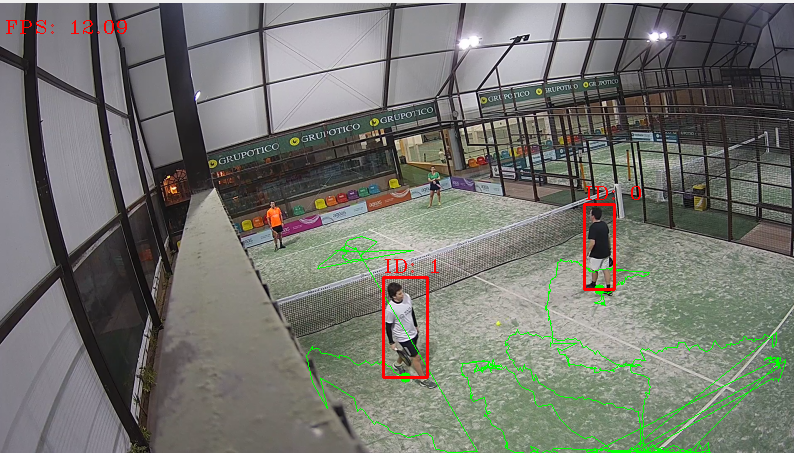
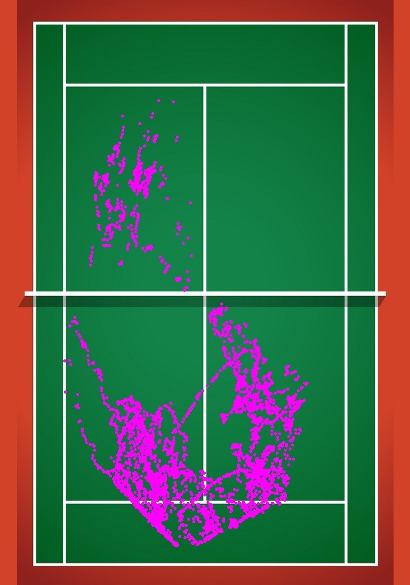

# Heatmap

This repository implements the concept of a heatmap for video recordings, which highlights the occurences of objects of interests that are moving in a static scene. A scene can be a sportfield, a public place, a shop, a factory or any physical place in this world. Objects can be persons, cars, boxes in a factory, players on a field, or anything else that create differences in a static scene.

> A heatmap is a graphical representation of data that uses a system of color-coding to represent different values. 

Heatmaps are produced by processing one or more recordings of a static scene, and tracking one or more object of interests. As illustrated before, scenes and objects are of your own interest and will vary from usecase to usecase.

## The implementation

Heatmapping is a post-process, which means that before you can create any heatmap you will need a pipeline of recordings or images. Heatmaps are generated over time and can bring huge value, they provide insights of a specific scene at a specific time (a retail store is more crowdy when having discounts).

Creating this pipeline or continuous flow of data can be challenging to develop. You might need to scale over multiple scenes (stores, fields, etc) and multiple cameras in a scene can be installed. To solve this, and this goes beyond this repository, we will use the [Kerberos Enterprise Suite stack](https://doc.kerberos.io/enterprise/first-things-first/). This stack will allow us to easily onboard and scale video cameras, and attach them to a video pipeline, so we will get new recordings served as soon they become available. Bottom line Kerberos Enterprise will help us to focus on our usecase and not the complexity of scale and onboarding IP cameras.

Easily explained, this is what the project is doing.

1. A Kafka broker connection of [Kerberos Enterprise](https://doc.kerberos.io/enterprise/first-things-first/) is established, and new recordings are received.
2. The relevant recording is downloaded from [Kerberos Vault](https://doc.kerberos.io/vault/first-things-first/) and stored in memory 
3. The recording is opened and gets read frame by frame.
4. A detector for example MobileNetSSD recognizes a human, car, or other objects. 
5. BoundingBoxes get placed around the object of interest. 
6. Non max surpression merges overlapping bbox into one.
7. The coordinates of the bbox get saved and converted using a homography transformation. 

## Dependencies

| Packages|
|--------|
| python 3.8 |
| OpenCV |
| datetime |
| numpy |
| collections - Defaultdict |
| pandas |
| imutils |

## Examples

This repository has been executed and tested in different environments

### Sports 

Using video recordings from a paddel playingfield we are trying to map the locations players have walked. First we capture there movement and later on we convert the coordinates and plot them onto an image of the playingfield. This will give us insight in where people mostly walk and what areas are left unattended.

### Retail shop

To be completed
